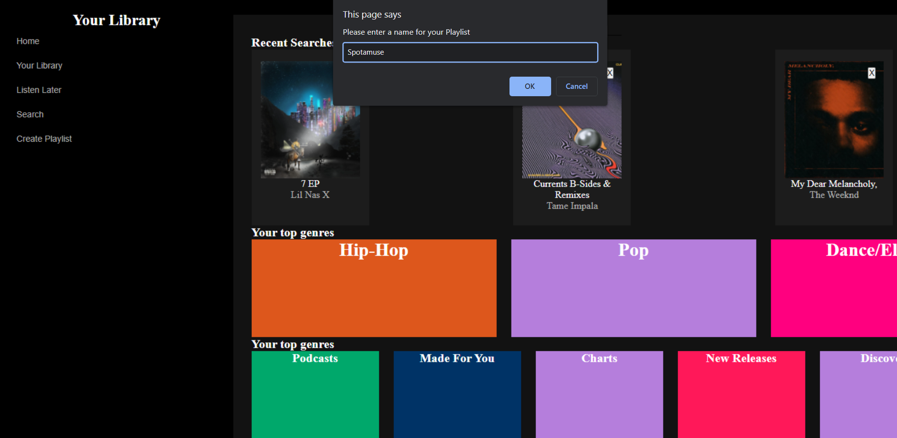

# Spotamuse (Work in Progress)   
#### Do you love music and wish you could add your own twist to your favorites? Speed up your songs, lower the pitch or organize your music to be more accessible with Spotamuse.

**Stack:** *HTML, CSS, Javascript, Typescript*

#### **Objective 📈:** **Reconstruct and Improve a Web Application (Spotify)**

#### **Purpose:** 

This project will give you a glimpse of the everyday processes companies employ to improve their services. Everyday, developers are 
testing new features and brainstorming new ideas. In addition, you will learn to consume data from a database or API. It's the first step towards backend and becoming a Full Stack Developer, as well as working with a team. 

**Requirements** 🚦

• *Must look 90%+ Identical to Spotify*

• *Must utilize an API or work with data*

• *After implementing base features, you must add new features to enhance the experience*

**Requirement Issues:** 

&emsp; &emsp;After researching the Spotify API, I realized you must have the user logged in to use the API. They also have to log in every 60 minutes. I researched if you could just automatically refresh tokens but it wasn't allowed. 
This forced me to develop the application without an API, which is a bummer but not the end. Instead, I will probably use the faker API and auto generate playlists for these fake users or use firestore to store and consume data.

&nbsp;

# Roadmap 📜
*Current Goal: Convert Javascript into Typescript to ensure quality and improve current program.*

## Version 1: Launch 🌌

*Sort Songs (most played, alphabetical, date created, date added)*

*Global rewind (play last played song)*

*Play a Random song from all your playlists (Global)*

*Last Played Personal Playlist (plays last 10 songs and updates with each song)*

*Play a playlist backwards*

*Listen to later tab. This can organize songs by priority, nonessential, eventually. Maybe even add discovery section 😁🤝*

## Version 2 🌌

*Folders for Spotify*

*Better queue grid*

*Album Order*

&emsp; &emsp; • create a preferred order of albums. This button switches between original and the ones you just want to hear. 

*Organization*

&emsp; &emsp;• Make breaks for Spotify playlists. (Breaks allow for random songs to be played within sections. EX you can’t play a song in section 2 if your skips aren’t broken. Max of 3 skips. Must hold to activate)

&emsp; &emsp;• temporary playlist through queue. It can repeat if you create a button to cycle. It’ll hit the button again and be signaled as the restart.
• Folders for Spotify 
• Sort Songs (most played, alphabetical, date created, date added)

Better Queue
• temporary playlist through queue. It can repeat if you create a button to cycle. It’ll hit the button again and be signaled as the restart.

&nbsp;

# Current Bugs 😎

*Note: M = Major, n = nothing serious*

*• M1: Playlist tracks can't be played if cover or song info is touched. | Messing with Z-index didn't solve this issue. Will have to research later.* 

&nbsp;

# Realizations ⌛️

• If there is an error in HTML markup, your css grid will break. 

&nbsp;

&nbsp;

*📚 Sources*

>Although there is this website that uses the spotify API with no auth, I don't want to risk safety. 

http://sixdegreesofkanyewest.com/699OTQXzgjhIYAHMy9RyPD

>Searches with no Log In's.

https://spotify-search-artist.glitch.me/

>Audiomack has auth points. Couldn't use

https://api.audiomack.com/v1/music/rap/trending (1003, 401)

https://audiomack.com/v1/search?q=the%20weeknd (1003, 401)

https://api.audiomack.com/v1/music/song/the-weeknd/song/save-your-tears (1003, 401)

https://api.audiomack.com/v1/playlist/trending (1003, 401)

